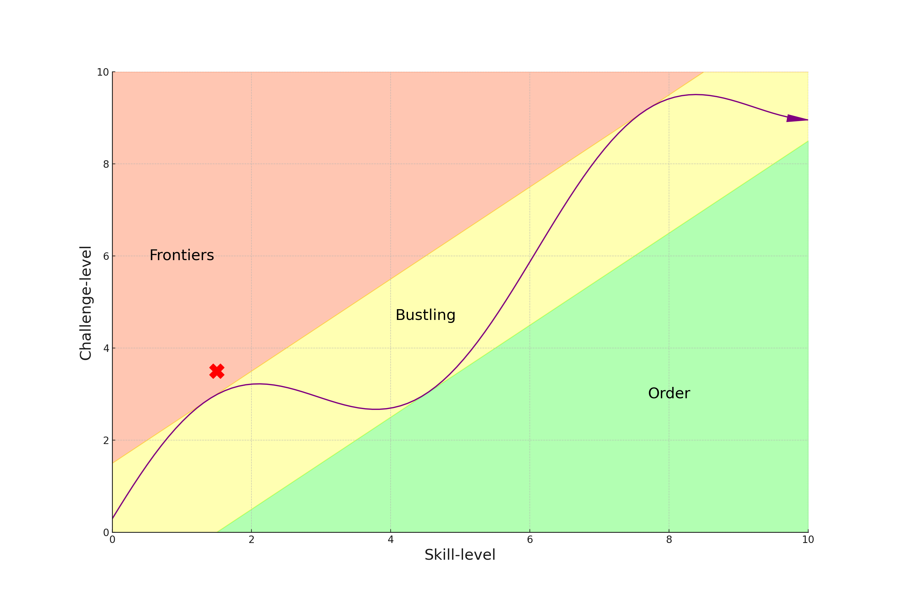

> *Frailty commeth upon [Russell Brand](https://www.youtube.com/watch?v=ai9f0Vbfwg0)!*     
*Music is the ultimate metaphor*       
*Yes, it `resonates` with me*
  

 
 > 
 
                                        1. Root
                                               \
                              2. Pentatonic -> 4. Chromatic -> 5. Temperament -> 6. Expression
                                               /
                                               3. Diatonic

### Man/`Titans`
##### (Alterations/Meaning: ♭9,♯9,♯11,♭13) 
5. Temperament/[Heretical](https://www.gutenberg.org/cache/epub/27458/pg27458-images.html)
6. Expression
### Art/`Olympians`
##### (Extensions/Cast: 11th, 13th)
3. Diatonic/Mundane: Apollo (11th)
4. Chromatic: Dionysus (13th)
### God/`Protogenoi`
##### (Foundation/Stage: 1st, 3rd, 5th, ♭♭7, 9th)
1. Root/Ecclessiastical: Erebus
2. Pentatonic: [Chaos (1st), Gaia (9th), Tartarus (3rd)], [Eros (5th), Nyx (♭♭7)]

